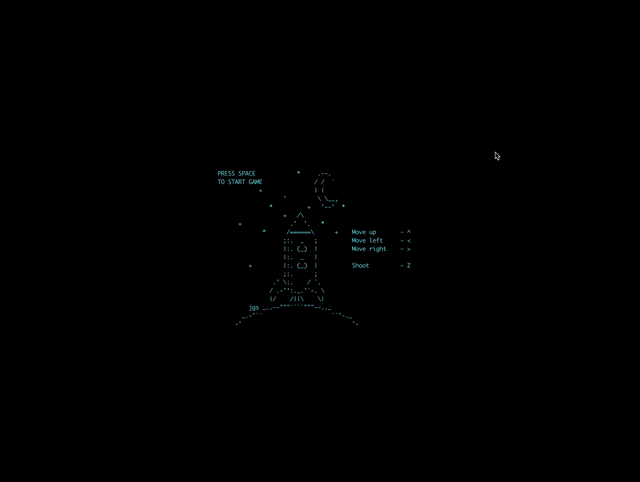

# ft_retro

The goal of this project is to implement a simplistic shoot-em-up-style game in your
terminal. For those of you who don’t know what that kind of game is (shame on you, by
the way), have a look at Gradius, R-Type, etc...

Here are the basic requirements :
1. Single-player
2. Display using the ncurses library
3. Horizontal or vertical scrolling (The screen area moves through the world, very
much like in R-Type for example)
4. Random enemies
5. The player can shoot at enemies
6. Basic collision handling (If an enemy touches you, you die)
7. Game entities occupy one ’square’ of the map only.
8. Frame-based timing

## Code

1. C++

### Demo
